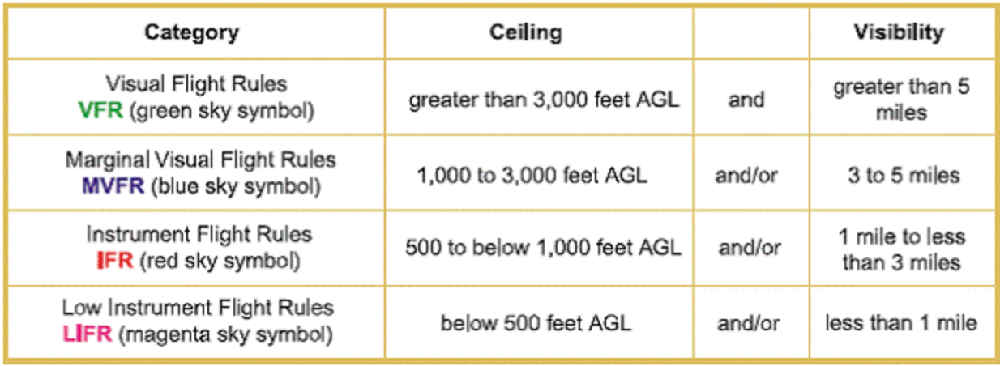

## Aviation Weather

An aviation weather app built for pilots and dispatchers to consolidate multiple reporting stations onto one fast and easy to use page for quicker flight planning.

> **Flight planning** is the process of producing a [flight plan](https://en.wikipedia.org/wiki/Flight_plan "Flight plan") to describe a proposed aircraft flight. It involves two [safety-critical](https://en.wikipedia.org/wiki/Life-critical_system "Life-critical system") aspects: fuel calculation, to ensure that the aircraft can safely reach the destination, and compliance with [air traffic control](https://en.wikipedia.org/wiki/Air_traffic_control "Air traffic control") requirements, to minimise the risk of midair collision. In addition, [flight planners](https://en.wikipedia.org/wiki/Flight_planner "Flight planner") normally wish to minimise flight cost through the appropriate choice of route, height, and speed, and by loading the minimum necessary fuel on board. [Air Traffic Services](https://en.wikipedia.org/wiki/Air_Traffic_Services "Air Traffic Services") (ATS) use the completed flight plan for separation of aircraft in air traffic management services, including tracking and finding lost aircraft, during search and rescue (SAR) missions.

Flight planning requires accurate weather forecasts so that fuel consumption calculations can account for the fuel consumption effects of [head or tail winds](https://en.wikipedia.org/wiki/Headwind "Headwind") and air temperature. Safety regulations require aircraft to carry fuel beyond the minimum needed to fly from origin to destination, allowing for unforeseen circumstances or for diversion to another airport if the planned destination becomes unavailable.

### Some resources if you've never read aviation formatted weather data...

[how to read METAR and TAF reports](https://pilotinstitute.com/metar-and-taf-reports/)

[how to read GFA reports](https://flightplanning.navcanada.ca/cgi-bin/CreePage.pl?Page=info-gfa&NoSession=NS_Inconnu&TypeDoc=gfa&Langue=anglais#abbr_symb)

### Built with...

- React.js
- React Router
- VITE
- AVWX REST API

[Aviation Weather](https://cameronmellis.github.io/aviation-weather/)

Shoutout to Mitch [(@ecumene)](https://github.com/ecumene) for all the help!
