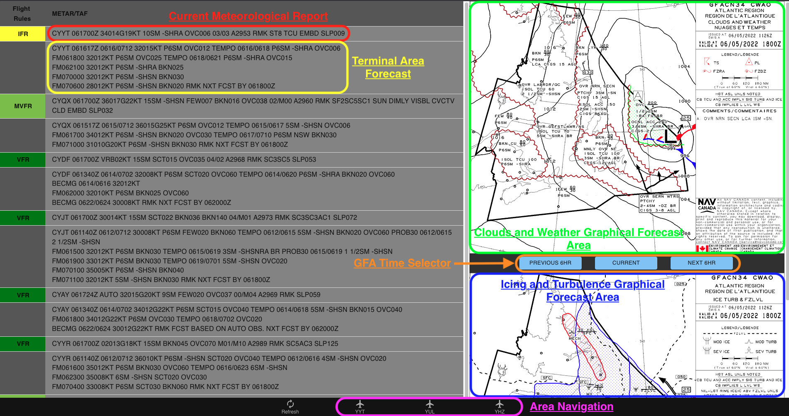
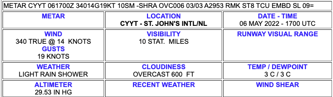

## Aviation Weather

An aviation weather app built for pilots and dispatchers to consolidate multiple reporting stations onto one fast and easy to use page.

### Some resources if you've never read aviation formatted weather data...

[how to read METAR and TAF reports](https://pilotinstitute.com/metar-and-taf-reports/)

[how to read GFA reports](https://flightplanning.navcanada.ca/cgi-bin/CreePage.pl?Page=info-gfa&NoSession=NS_Inconnu&TypeDoc=gfa&Langue=anglais#abbr_symb)

### Built with...

- React.js
- React Router
- VITE
- AVWX REST API

[Aviation Weather](https://cameronmellis.github.io/aviation-weather/)

Shoutout to Mitch [(@ecumene)](https://github.com/ecumene) for all the help!
